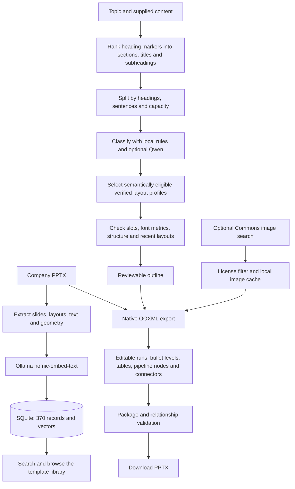

# OneClick-Away architecture

Optional inference, embeddings, template search and PowerPoint assembly run on the local computer. The manual prompt workflow uses the user's chosen external AI website for writing. Optional Wikimedia image search is the only external content request made by the backend.

Template text is reference data. Template sample numbers are never promoted to factual company claims. Supplied body words and numbers are retained, with source text and layout provenance stored in speaker notes. Local AI classifies content without replacing body text.

`backend/richtext.py` holds the two parsing concerns. Block parsing decides what a line is: a heading and at which ranked tier, a subheading, a quoted callout, a nested bullet, or a slide break. Inline parsing decides how text reads and produces formatting runs. Ranking is relative to the markers a document actually uses, so no single Markdown dialect is imposed. Nothing in this module rewrites wording.

Outline items stay plain strings so the browser can round-trip them, and block structure is encoded in prefixes the parser reads back: two spaces per nesting level, `### ` for a subheading, `> ` for a quote. The browser mirrors the same rules to preview each slide before export.

Library search ranks templates by cosine similarity when compatible embeddings are available and uses lexical matching otherwise. Automatic generation currently uses verified profile rules, not the library search ranking. Its layout selector filters by content type, mapped editable slots, item count and measured font capacity, then considers recent layouts for variety. It can reuse a suitable layout. Structural fit matters because a layout that places one item in each decorated slot cannot express a subheading or a nested point, and a two-column layout must break where a subheading starts. The outline carries selected template IDs, design settings, section membership, optional image provenance and diagram specifications, so the export is reviewable and repeatable.

Version 8 preserves the sequence in authored Markdown and numbered slide outlines. It only groups unstructured notes automatically. Local AI still classifies content without rewriting the supplied body. Installing a larger model or rebuilding embeddings does not itself add content refinement, semantic automatic layout ranking or visual review; those require explicit application integration.

Capacity measurement and rendering share one set of numbers: the role size scale, the level indents and the paragraph spacing all live in `backend/design.py` and are read by both `fitted_size` and the exporter. A slide therefore cannot be planned as readable and then render overfull. Section dividers keep the template's own caption colour and paragraph properties instead of an assumed colour, so contrast against the original artwork is correct by construction.

The FastAPI service persists JSON jobs in `data/jobs.sqlite3`. Each process runs a polling worker; SQLite write transactions allow only one active generation across processes on the same host. Renewable leases detect interrupted workers. Queued jobs survive restart; interrupted running jobs fail visibly. Progress is served through the owner-checked `/api/jobs/{id}` endpoint. Generated decks and JSON outlines live in `output/generated/`. No paid API, hosted vector database, or PowerPoint installation is required for generation. The installed PowerPoint application is used only for development-time rendering checks.

The UI can be replaced without changing the pipeline. Its main contract is `POST /api/plan`, review the returned `DeckPlan`, then `POST /api/generate`.

## Service boundaries (version 9)

`app.py` composes middleware, routes and worker lifecycle. `routes.py` validates
HTTP input and authorizes resources. `job_store.py` owns atomic queue claims,
resource grants and retention. `worker.py` dispatches serializable plan/export
payloads. No request stores Python closures for later execution.

`RequestLimit` bounds request bytes before FastAPI parses JSON, with or without
Content-Length. `BrowserBoundary` rejects unapproved mutation origins and assigns
an opaque HttpOnly session cookie; only its hash is stored as resource ownership.
Job results, images and downloads require that owner. This is not account login.

The renderer is separated into drawing primitives, slide construction, and
package graph validation under `backend/presentation/`. `exporter.py` retains the
public orchestration API. Browser modules separate transport, rich text,
storyboards and the external-AI prompt workflow from editor state.

New runtime files expire after the configured retention period. Cleanup holds the
same database write lock as resource publication and skips resource deletion
while any job is pending, so queued image references remain valid. Expired links
are denied immediately. Historical outputs and source templates are untouched.

The deployment unit is a single host with local persistent storage. Independent
replicas, shared network filesystems and account-based collaboration require a
separate queue/database and storage design. JSON logs carry job IDs and traceback
details for operators. See `docs/DEPLOYMENT.md` for environment settings.
