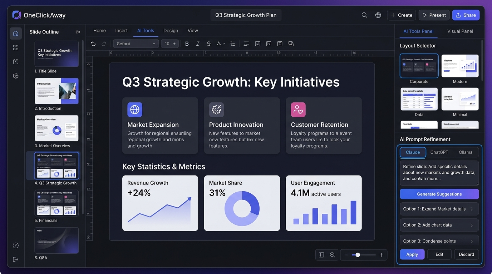
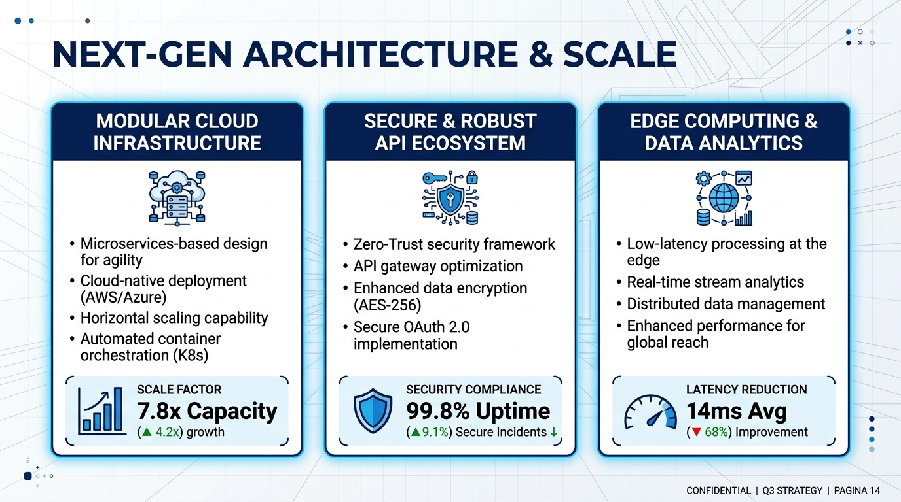

# OneClick-Away

<p align="center">
  <strong>A local-first presentation studio that turns reviewed content into editable, branded PowerPoint decks.</strong>
</p>

<p align="center">
  
  
  
  
  
  
</p>

---

## 📸 Visual Showcase

<p align="center">
  <em>The In-Browser Studio & Interactive Layout Editor</em><br />
  
</p>

<p align="center">
  <em>Native, Fully-Editable PowerPoint Slide Output</em><br />
  
</p>

---

## 🌟 Key Features

- 📑 **100% Native & Editable PowerPoint**: Generates genuine PowerPoint shapes, text boxes, and tables via `python-pptx` (not rasterized screenshots or fixed images).
- 🎨 **Branded Layout Engine**: Automatically maps content structure to matching corporate slide archetypes (title, 3-column cards, comparison tables, timeline, metrics).
- 📝 **In-Browser Storyboard Editor**: Review, reorder, edit slide titles, adjust bullet points, and preview fitted text before export.
- 📊 **Rich Slide Elements**: Automatic generation of formatted data tables, Mermaid flowcharts, and custom image uploads.
- 🤖 **Pragmatic AI Workflow**: Designed for a human-in-the-loop pipeline. Supports copy-paste prompt templates for **ChatGPT**, **Claude**, and **Gemini**, with optional **local Ollama** classification for automatic layout tagging while strictly preserving your supplied text.
- 🛡️ **Durable Background Job Queue**: SQLite-backed job store with atomic lease renewal; long-running jobs resume or report cleanly across server restarts.
- 🔒 **Local-First & Anonymous Isolation**: All rendering runs on your machine. HttpOnly browser cookies scope session jobs, uploads, and outputs without requiring cloud sign-ins.

---

## 🤖 How AI is Used

OneClick-Away is not a black-box text generator that hallucinates slides. Instead, it provides:
1. **Prompt Workflow Templates**: Pre-structured prompts tailored for Claude, ChatGPT, or Gemini to turn raw notes or transcripts into structured slide JSON.
2. **Optional Ollama Local Classification**: Can categorize slide content types (e.g., comparison vs. process vs. statistics) on-device using a local model without sending data over the network.
3. **Deterministic Layout Compiler**: Transforms verified content into pixel-precise `.pptx` presentations according to your master slide dimensions.

---

## 🚀 Quick Start

Requires **Python 3.12**. Node.js is only used for dev lint checks.

### 1. Setup Virtual Environment
```powershell
python -m venv .venv
.venv\Scripts\Activate.ps1
python -m pip install -r requirements.txt
```

### 2. Configure Your PowerPoint Template
```powershell
python scripts/setup.py --template "C:\path\to\your_template.pptx" --lexical
```

### 3. Launch Studio
```powershell
python scripts/run.py
```
Open **http://127.0.0.1:8765** in your browser. Windows users can also launch via `start.bat`.

> **Note**: Microsoft PowerPoint is **not required** on the machine to generate presentations.

---

## 🏗️ Repository Structure

| Location | Responsibility |
| --- | --- |
| `backend/app.py`, `routes.py` | FastAPI application lifecycle and REST endpoints |
| `backend/job_store.py`, `worker.py` | Durable job queue, ownership leases, atomic recovery, and expiry |
| `backend/middleware.py` | Streaming request limits, size caps, and browser session scoping |
| `backend/planner.py`, `template_engine.py` | Content planning, schema validation, and layout selection |
| `backend/presentation/` | Slide drawing, shape positioning, and package validation |
| `backend/exporter.py` | Export orchestration and stable Python API entry point |
| `static/app.js`, `static/js/` | In-browser studio, slide outline, previews, and storyboard |
| `tests/`, `scripts/`, `docs/` | Automated regression tests, template setup tools, and guides |

---

## 🛡️ Reliability & Security

- **Process Crash Recovery**: Queued jobs and completed results survive restarts in SQLite. Atomic claims serialize generation across multi-process workers.
- **Heartbeat & Lease Management**: Active workers renew a 90-second lease. If a worker process dies, jobs are detected as interrupted and queued tasks resume cleanly.
- **Session Privacy**: HttpOnly browser cookies scope jobs, uploaded images, and generated `.pptx` downloads to the current browser session.
- **Strict Size Caps**: Enforces streaming request limits before JSON parsing to protect against memory exhaustion.
- **Automatic Lifecycle Sweeps**: Ephemeral runtime files expire after seven days. Background sweeps clean up idle data while protecting pending jobs.

---

## ⚠️ Known Limitations

- **Template Dependency**: The generator is calibrated for a specific branded master template (such as the KaarTech slide collection). Arbitrary random PPTX files cannot be swapped without calibrating layout coordinates.
- **Proprietary Master Template Not Bundled**: Corporate master `.pptx` templates containing proprietary branding are intentionally excluded from the Git repository. Users must supply their own configured template via `setup.py`.
- **Single-Host Architecture**: Optimized for single-server or workstation deployment using SQLite and local filesystem storage. Multi-host horizontal scaling requires configuring an external queue (e.g. Redis/Celery) and shared S3 storage.
- **Anonymous Cookie Sessions**: Session isolation relies on browser cookies rather than a persistent user database. Clearing browser data clears access to past generated decks.

---

## 🧪 Verification & Testing

```powershell
python -m pip install -r requirements-dev.txt
python -m ruff check backend
python -m ruff format --check backend scripts tests
python -m unittest discover -s tests -p test_service.py
```

For browser UI testing:
```powershell
python tests/ui_smoke.py
```

---

## 📜 License & Branding Notice

- **Software License**: The application source code is licensed under the [MIT License](LICENSE).
- **Branding & Assets**: All corporate trademarks, logos, and master slide templates remain the proprietary intellectual property of their respective owners and may not be redistributed without permission.
